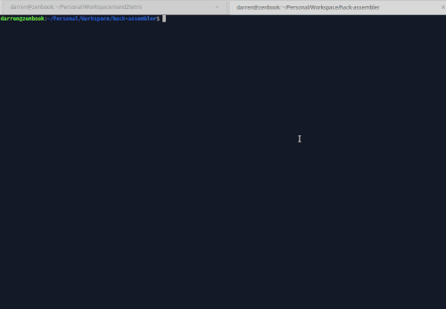

# Hack Assembler

An assembler that translates Hack assembly programs into executable Hack binary code (nand2tetris)



### Usage

```bash
git clone https://github.com/TheInvader360/hack-assembler
cd hack-assembler
```

Then:

```bash
go run HackAssembler.go examples/Add.asm
```

The assembled binary is exported to the source directory with the same base filename but a .hack extension (so the given example would generate examples/Add.hack)
